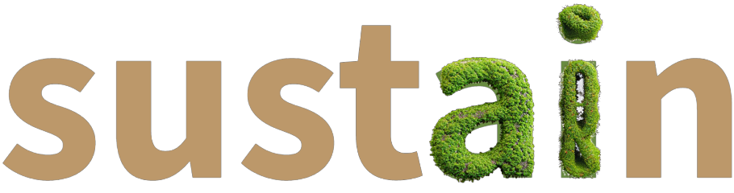
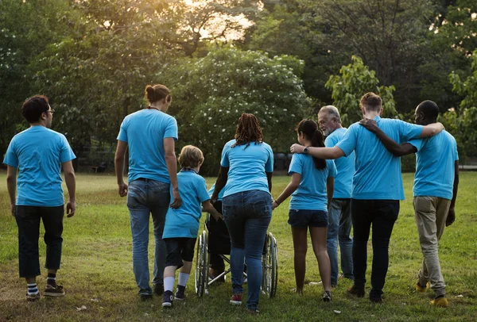

<!-- PROJECT SHIELDS -->
<!--
*** I'm using markdown "reference style" links for readability.
*** Reference links are enclosed in brackets [ ] instead of parentheses ( ).
*** See the bottom of this document for the declaration of the reference variables
*** for contributors-url, forks-url, etc. This is an optional, concise syntax you may use.
*** https://www.markdownguide.org/basic-syntax/#reference-style-links
-->
[![Contributors][contributors-shield]][contributors-url]
[![Forks][forks-shield]][forks-url]
[![Stargazers][stars-shield]][stars-url]
[![Issues][issues-shield]][issues-url]
[![MIT License][license-shield]][license-url]
[![LinkedIn][linkedin-shield]][linkedin-url]

<!-- PROJECT LOGO -->
 

  

<h3 align="center">A Sustainability-Focused Social Media</h3>

  

     
    <a href="https://github.com/SuperBots123/sustain"><strong>Explore the docs »</strong></a>
     
     
    <a href="https://github.com/SuperBots123/sustain">View Demo</a>
    ·
    <a href="https://github.com/SuperBots123/sustain/issues">Report Bug</a>
    ·
    <a href="https://github.com/SuperBots123/sustain/issues">Request Feature</a>
  

<!-- TABLE OF CONTENTS -->

  
Table of Contents

  <ol>
    <li>
      <a href="#about-the-project">About The Project</a>
      <ul>
        <li><a href="#built-with">Built With</a></li>
      </ul>
    </li>
    <li><a href="#usage">Usage</a></li>
    <li><a href="#contact">Contact</a></li>
    <li><a href="#acknowledgments">Acknowledgments</a></li>
  </ol>

<!-- ABOUT THE PROJECT -->
## About The Project

  

 

"Sustain" is the revolutionary social media platform dedicated to advancing a sustainable world. Users share and celebrate their community service acts, from environmental initiatives to social causes. With Sustain, global citizens unite to create positive change, earn recognition, and inspire a brighter, more sustainable future for all. Join us in the journey toward a better world, one act at a time.

(<a href="#readme-top">back to top</a>)

### Built With

* [![Django][Django.com]][Django-url]
* [![React][React.js]][React-url]
* [![Bootstrap][Bootstrap.com]][Bootstrap-url]
* [![JQuery][JQuery.com]][JQuery-url]
* [![Sqlite][Sqlite.com]][Sqlite-url]

(<a href="#readme-top">back to top</a>)

<!-- USAGE EXAMPLES -->
## Usage

Sustainability prompts are generated through a GPT Query, utilizing OpenAI's proprietary API. Users can select a category and a time frame for a generatable prompt, and then are given the challenge to complete. Once completed, the user can upload an image of them doing the challenge for others to see. Users can add friends to see in their feed.

_For examples of OpenAI's API, please refer to the [Documentation](https://openai.com/blog/openai-api)_

(<a href="#readme-top">back to top</a>)

<!-- CONTACT -->
## Contact

* John Donahoe - jdonahoe8@gatech.edu

* Cole McGinnis - cmcginnis8@gatech.edu

* Tawfiq Mohammed - tawfiq@gatech.edu

* Garrett Meek - garrettmeek@gatech.edu

Project Link: [https://github.com/SuperBots123/sustain](https://github.com/SuperBots123/sustain)

(<a href="#readme-top">back to top</a>)

<!-- ACKNOWLEDGMENTS -->
## Acknowledgments

* [Built for HackGT X](https://hack.gt/)

(<a href="#readme-top">back to top</a>)

<!-- MARKDOWN LINKS & IMAGES -->
<!-- https://www.markdownguide.org/basic-syntax/#reference-style-links -->
[contributors-shield]: https://img.shields.io/github/contributors/SuperBots123/sustain.svg?style=for-the-badge
[contributors-url]: https://github.com/SuperBots123/sustain/graphs/contributors
[forks-shield]: https://img.shields.io/github/forks/SuperBots123/sustain.svg?style=for-the-badge
[forks-url]: https://github.com/SuperBots123/sustain/network/members
[stars-shield]: https://img.shields.io/github/stars/SuperBots123/sustain.svg?style=for-the-badge
[stars-url]: https://github.com/SuperBots123/sustain/stargazers
[issues-shield]: https://img.shields.io/github/issues/SuperBots123/sustain.svg?style=for-the-badge
[issues-url]: https://github.com/SuperBots123/sustain/issues
[license-shield]: https://img.shields.io/github/license/SuperBots123/sustain.svg?style=for-the-badge
[license-url]: https://github.com/SuperBots123/sustain/blob/master/LICENSE.txt
[linkedin-shield]: https://img.shields.io/badge/-LinkedIn-black.svg?style=for-the-badge&logo=linkedin&colorB=555
[linkedin-url]: https://linkedin.com/in/linkedin_username
[product-screenshot]: sustain/static/img/comm_serv.png
[React.js]: https://img.shields.io/badge/React-20232A?style=for-the-badge&logo=react&logoColor=61DAFB
[React-url]: https://reactjs.org/
[Bootstrap.com]: https://img.shields.io/badge/Bootstrap-563D7C?style=for-the-badge&logo=bootstrap&logoColor=white
[Bootstrap-url]: https://getbootstrap.com
[JQuery.com]: https://img.shields.io/badge/jQuery-0769AD?style=for-the-badge&logo=jquery&logoColor=white
[JQuery-url]: https://jquery.com 
[Django.com]: https://img.shields.io/badge/Django-092E20?style=for-the-badge&logo=django&logoColor=white
[Django-url]: https://www.djangoproject.com/
[Sqlite.com]: https://img.shields.io/badge/SQLite-07405E?style=for-the-badge&logo=sqlite&logoColor=white
[Sqlite-url]: https://www.sqlite.org/index.html
